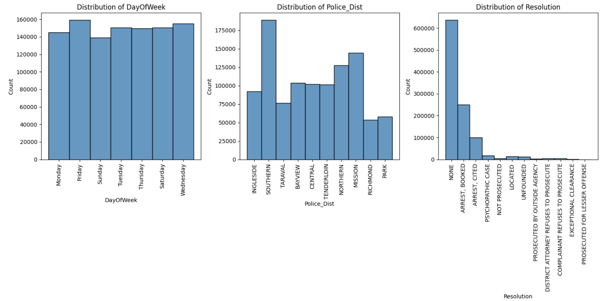
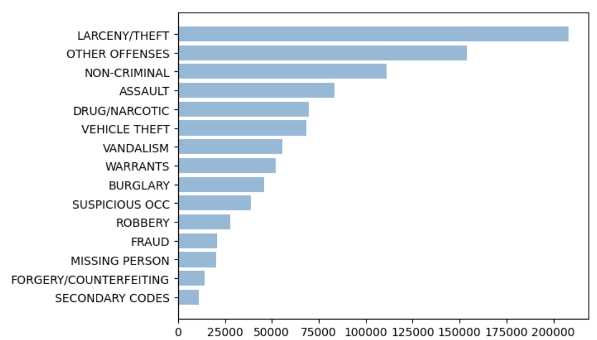
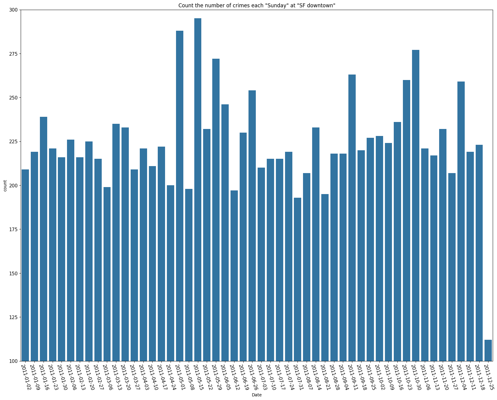

# I. Introduction

Crime is characterized as an “act of felony or grave offense against society or someone else's property which is prohibited by law. As noted in @tayebi2015learning crime does not happen evenly across all places and that specific types of crime tend to occur more often in certain areas that are called crime hotspots [@sherman1989hot]. Hence, the spatial analysis [@tayebi2012understanding] of different types of crimes along with the areas of occurrence helps in accurately predicting the different types of crime expected to occur in future. @brantingham2010nodes has been shown to improve prediction of the time and the day of crime. Accurate forecasting of crime hotspots helps in effective management of law enforcement, see @rossmo1999geographic and @weisburd2012criminology in mitigating the crime, hence improving the safety of the communities.

With this objective, in the paper we illustrate the systematic process of understand different factors that are helpful in predicting crimes based on historical data. We also explore the background work associated with crime analysis and summarise the research done in the field of crime analysis using ML and different approaches. 

# II. Background

There are quite a few papers that are published to analyze crime and have used machine learning approaches to predict the crime categories. These papers have explored the different patterns, attributes and categories of crimes that are associated with data. @darshan2022crime gives an overview of the machine learning classification algorithms for the crime classification, but deals with only a few categories of crime and limited parameters associated with the ML approach. @gahalot2020crime reviews how artificial intelligence approaches have been utilized in the crime prediction field. This gives us insight on data collection, pre-processing, classification, pattern identification and finally, the comparison of different data mining. The authors also explored artificial neural network 
methods on the crime data based on weekdays and weekends using 100 hidden layers and adam solver but the accuracy had dropped very low. The paper @pandya2022analysis combines social media and offline sources to isolate crime behavior. The model categorizes an individual as a suspect, normal, or a criminal but it is completely at the higher level and further investigation and other processes needs to be carried out to reduce
false positives and false negatives. This is limited to specific types
of data and text. The paper @yadav2017crime gives a good overview of association mining, clustering, classification technique, correlation, and regression but not breakthrough in any of the methods. @menaka2022analysis proposes approaches to identify patterns from crime records to aid in investigation, control and prevention. 


The paper @al2022intelligent explored quite a few things towards predicting crimes that happen at different places and categories of crime that have occurred at a specific place with accuracy depending on number of classes. The paper utilized different ML techniques to analyze and predict the crimes. It gives us a path on how to deal with huge amounts of data for analysis and model creation. Random Forest, Adaboost and Gradient boosting gave good accuracy for different classes. They also talk about KNN and how they tested by moving the K value from 100, 1000, 6000 and so on. The value 6000 gave good accuracy. They used a Decision tree with depth of 5 for better accuracy. They brief about different types of visualization to understand the data in a much better way. The paper talked about ANN Initially but there is not much importance or usage of ANN. It provides details of accuracy of different models for reduction in classes but no details about any class. Even though the accuracy of naive Bayes and KNN is lower compared to random forest, Adaboost and gradient boosting, they have used those for prediction and are not sure about the reason behind the same. The model and other factors are specific to the San Francisco dataset and looks like data is skewed towards two places in east San Francisco. Analysis on different cities will give more clarity on the performance of the models. Effective visualization can still be done in different ways, but it is not defined, and no analysis done on resolution.

Even Though many papers explored the usage of Machine learning and Artificial neural network methods, the efficient and robustness of these methods are not much utilized. And also, the advanced methods like TabNet, successful achievement of the higher accuracy and flexibility of end-to-end usage of only python libraries are not considered.

In this paper, the San Francisco dataset is considered as an important dataset because of geographical location. It is one of the busiest cities in the United States of America and it facilitates air, water and land transportation and also contains people from different diversity at different social standards. It is covered with more bay areas and supports more sea transportation. As it has a thick population, high transportation, diversities and more tourist attractions, it is prone to have more crimes. In order to discover the hidden secret of the crimes in the San Francisco data we apply not only machine learning approaches but also different flavors of Artificial Intelligence such as Artificial neural network, Tabnet which is a customized method and other effective methods for detecting crimes in the San Francisco region. These models and methods not only perform better but also facilitate better hyperparameter tuning techniques.


# III. Methodology

The goal of the project is to analyze and visualize the spatial and temporal relationship of crimes on various attributes and predict the category of crime in a particular location, address the limitation of existing papers and further look towards the enhancement to explore the usage of ANN and different AI methodology. Focus towards the cost of infrastructure to use only python language and its libraries to build all the requirements of the project. The project also covers the interactive dashboard and web application using python libraries such as folium, geopandas and widgets. The flexibility of the project to use the complete approach on different cities' crime dataset like BOSTON to showcase its analysis , performance and effective metrics to provide more meaning to the model and its architecture. Explore the possibility to relate the data skewness to the population or poverty, or others based on the area using census data.

## A. Data Acquisition

The data for the analysis was downloaded from San Francisco Police Department Crime incident reporting system (https://data.sfgov.org ). The data contains the details of the crime from 2003 to 2022. The data consists of two csv files, the first csv file has data from 2003 to 2018 and the second is from 2018 to 2022. The data 2003 to 2018 contains 37 incident categories whereas 2018 to 2022 contains 50 incident categories. Boston crime data obtained from boston website (https://data.boston.gov/dataset) contains historical data of the year 2022 from the police department incident report. The data consists of 50 incident categories.

## B. Data Preprocessing

The quality of data helps in providing valuable information and helps in building the models. Some of the methods that are followed to improve the quality of the data are data cleaning which involve removing the invalid or unnecessary rows, addressing the missing values, data transformation which involves extraction of new features from existing attributes and combining the required attributes to create the new features, data reduction involves discarding the null record or attributes that are not required or correlated and data conversion involves the conversion of character categorical to numeric categorical. The streaming of the data with defined attributes are taken care to facilitate the use of most of the crime data to carry out the analysis.

## C. Visualization and Presentation

The data obtained was processed to handle missing values, data formatting before performing exploratory data analysis. The attributes time of day, hour, latitude, longitude, and police distinct are highly correlated attributes. The attributes such as day of the week, time of the day and seasons of the year are important factors for the crimes. Figure 1 shows the incident count on different days. It is observed that most of the crimes happen on Friday and most frequently occurring crimes are theft, burglary, robbery, missing person, and drugs. There are quick resolutions for cases like robbery, burglary, and assault. Figure 2 shows the geographical view of the crimes in the San Francisco region. More crimes are committed in the north-east part of San Francisco. Figure 3 and Figure 4 represent the high density of the Top crime categories in the San Francisco region.

```{r,  out.width="85%", fig.cap="Crime analysis based on Day of week, Police District and its resolution",fig.align = "center", echo= FALSE}

```


```{r,  out.width="70%", fig.cap="High number of incidents concentrated in the mission district of San Francisco",fig.align = "center", echo= FALSE}

```

```{r,  out.width="70%", fig.cap="High density of different incident categories",fig.align = "center", echo= FALSE}

```

```{r,  out.width="70%", fig.cap="Top incident categories",fig.align = "center", echo= FALSE}

```

Figure 5 shows the heat map of incidents based on the weekdays and brighter represents the hotspots of the categories. Figure 6 shows the heatmap of incidents based on the time of the day. Most of the crimes are happening in the afternoon and evening hours. Figure 7 represents the heat map representation based on the season. It shows spring and autumn are favorable for crime cases.

```{r,  out.width="70%", fig.cap="Incidents heat map based on the day of the week",fig.align = "center", echo= FALSE}
knitr::include_graphics("img/fig5.png")
```

```{r,  out.width="70%", fig.cap="Incidents heat map based on the time of day",fig.align = "center", echo= FALSE}
knitr::include_graphics("img/fig6.png")
```


```{r,  out.width="70%", fig.cap="Incidents heat map based on the time of day",fig.align = "center", echo= FALSE}

```

Figure 8 shows the attribute analysis based on the correlation between them. The scale from 0 to 1 indicates the correlation and higher the value closer to the relation of the attributes. Figure 9 shows the number of crimes on specific days of the week. It shows crime occurrences every Sunday. The count has reached 300 on specific Sunday in a year and the minimum crime count on Sunday is 200.

```{r,  out.width="90%", fig.cap="Correlation analysis of different factors",fig.align = "center", echo= FALSE}

```


```{r,  out.width="80%", fig.cap="Number of crimes occurred on Sunday basis",fig.align = "center", echo= FALSE}

```

```{r,  out.width="70%", fig.cap="Top crimes occurred based on the map",fig.align = "center", echo= FALSE}

```

```{r,  out.width="50%", fig.cap="Crime count based on the year",fig.align = "center", echo= FALSE}

```

Figure 10 shows the scatter plot of Top crimes across the San Francisco region. The seasons like summer and fall are attracting more crimes. The analysis clearly shows that the number of crimes had decreased during 2020, it might be because of Pandemic.  The crimes are mostly occurring during afternoon hours, and few are happening during evening hours. If we analyze the yearly trends, the occurrence of the crimes has changed from fall to winter after the pandemic. The attributes timeofday, hour, latitude, longitude, and police distinct are highly correlated attributes. Analysis of historical data from 2003 to 2018 gives more meaningful insights on the data pattern, trend and how to build the model.

The data of San Francisco from the year 2018 onwards shows quite deviation as follows.

- The number of crime categories have increased.
- Theft is the highest number of crimes that has been occurring continuously.
- Missing people crimes have dominated in recent years.
- It looks like the middle of the week which is Wednesday is tagged to Drug offense.
- Crime count has increased in proportion to population growth.
- Crimes more often occurring in the afternoon and pushing towards evening hours.
- More crimes that were occuring during winter in early 2018 has shifted to other seasons making winter quite non-crime seasons in the recent years.


The analysis drives the use of different models like Random Forest, K-nearest neighbor, ANN, Tablet and time series analysis are created to understand the behavior of the data with the model.

# IV. Methods

This project is intended to be used for crime applications, such as assistance for the crime victims, police department, Victim service division, crime map and public safety awareness, Crime rates and statistics, Attorney, and legal advocacy. It is particularly intended for public safety awareness.

Random Forest: Random Forest is an ensemble supervised machine learning algorithm for classification and regression problems. It involves building multiple decision trees on different samples and aggregating the predictions using a majority vote for classification.

The k-nearest neighbors (KNN) algorithm is a type of supervised machine learning algorithm used to solve classification. The algorithm estimates the likelihood that a data point will become a member of one group or another based on what group the data points nearest to it belong to. It is a non-parametric algorithm since it is robust to underlying distributions of the data.

Artificial neural networks are human brain cells inspired systems which are intended to replicate the way that humans learn. Neural networks consist of input and output layers, as well as (in most cases) a hidden layer consisting of units that transform the input into something that the output layer can be  used. ANNs have three layers that are interconnected and consist of neurons. The first layer sends data to the second layer, which in turn sends the next output to the third layer. ANNs are considered non-linear statistical data modeling tools where the complex relationships between inputs and outputs are modeled or patterns are found.


TabNet, @arik2021tabnet, is a deep tabular data learning architecture and one of the first transformer based models that uses sequential attention to choose which features to reason from at each decision step. The TabNet encoder is composed of a feature transformer, an attentive transformer and feature masking. A split block divides the processed representation to be used by the attentive transformer of the subsequent step as well as for the overall output. For each step, the feature selection mask provides interpretable information about the model's functionality, and the masks can be aggregated to obtain global feature important attribution. The TabNet decoder is composed of a feature transformer block at each step.

In the feature transformer block, a 4-layer network is used, where 2 are shared across all decision steps and 2 are decision step-dependent. Each layer is composed of a fully-connected (FC) layer, BN and GLU nonlinearity. An attentive transformer block is a single layer mapping modulated with a prior scale information which aggregates how much each feature has been used before the current decision step. sparsemax is used for normalization of the coefficients, resulting in sparse selection of the salient features. There are different parameters for fine tuning the model for better performance. The parameters like learning rate, epochs, decay rate, patience and batch size gives better control of the models. Some of the initial methods followed in the paper are

The learning rate is initially set to, lr = 0.020

After 20 epochs, a decay rate of 0.95 will be applied The result is simply the product of our learning rate and decay rate 0.02*0.95 then we fit the model to our data. Basically it says the train and validation sets will be evaluated for a total of 30 iterations (epochs). The patience parameter shows the improvement in metrics is not observed after 30 consecutive epochs help to get the best weights. The batch size of 10000 was selected based on recommendations from TabNet's paper, where they suggest a batch size of up to 10% of the total data.

Since the crime pattern also has a strong time based component we also explored time-series forecasting methods. These methods consider the history along with current data to forecast values through its trends over a period of time or a specific point in the future. Using time series models it is good to forecast the number of crimes that occur in the future. This can be drilled down further up to different category predictions.

# V. Metrics

Evaluation metrics include confusion metrics that contain the values of True positive, False Positive, True Negative and False Negative that helps in False Positive rate and False Negative rate to measure disproportionate model performance errors. The fraction of negative (not falling to the same category) and positive (same category) predictions that are incorrectly predicted to be positive and negative, respectively, are also reported. These metrics provide values for different errors that can be calculated and provide better understanding of classification. The accuracy of the models is between 83 -- 98 % achieved through different ML and AI approaches. All metrics reported at the .2 decision threshold. 


```{r,  out.width="70%", fig.cap="Confusion metrics for Random Forest",fig.align = "center", echo= FALSE}

```

```{r,  out.width="70%", fig.cap="Confusion metrics for K-Nearest Neighbor",fig.align = "center", echo= FALSE}
knitr::include_graphics("img/fig13.png")
```

```{r,  out.width="70%", fig.cap="Confusion metrics for Artificial Neural Network",fig.align = "center", echo= FALSE}

```


```{r,  out.width="70%", fig.cap="Confusion metrics for TabNet",fig.align = "center", echo= FALSE}
knitr::include_graphics("img/TabNet.png")
```

# VI. Discussion and Impact

We always approach ML algorithms for classification problems, but Deep learning models and TabNet are also good for classification problems on tabular data. To build the model's hyperparameter and different features are important factors for the algorithm. In the case of RandomForest using entropy criterion gives better accuracy than Gini Criterion. The number of estimators in K nearest neighbor plays a significant role in the algorithm. In ANN deep neural network architecture, activation, optimizer, and loss should be carefully chosen to get better performance. Learning, decay rate and batch size plays a major role in TabNet. Time series depends on how data is closely related to the previous trends. It is a good practice to keep a smaller number of classes or grouping similar classes as one to get better accuracy. High amount of data helps in fine tuning the model. Uniqueness and data consistency are important factors to build the model. If we build different models it provides more confidence and ideas to weigh to choose the model for prediction.

# VII. Evaluation and Reflection

Metrics like accuracy provides the confidence to identify the better performance of the model. Confusion matrix helps in visual representation of the prediction and its deviation. Classification reports provide the different metrics like precision, recall, f1-score for different classes of the categories. This gives better pictures on how the model is good enough for each classification. MSE and RMSE help in clear view of time series model performance. The loss function greatly influences the performance or accuracy of the model. Table 1 represent the accuracy of each model for different dataset and classes respresent the number of crime categories of the given data.


```{r, echo=FALSE}
library(kableExtra)
clm1 <- c("83.70 %", "98.79 %", "86.07 %", "89.25 %", "37.33 %", 37)

clm2 <- c("89.27 %", "98.59 %", "81.63 %", "86.29 %", "42.56 %", 50)

clm3 <- c("78.69 %", "72.70 %", "55.58 %", "63.53 %", "26.89 %", 120)

indnm <- c("RandomForest", "K Neighbor", "ANN", "TabNet", "TimeSeries", "Classes")

combdf <- cbind(indnm, clm1, clm2, clm3)

colnames(combdf) <- c("Model", "SFO(2003-18)", "SFO(2018-22)", "Boston(2022)")

combdf %>%
  kbl(caption = "Comparision of machine and deep learing models") %>%
  kable_classic(full_width = F, html_font = "Cambria")
```

# VIII. Application and Dashboard

## A. Web Application

To create the web application (henceforth referred as webapp) start with YAML code as the first line of the jupyter notebook by providing the required filters as part of the code. Define the dashboard name as part of the WebAPP page. The webapp needs the mercury libraries hence install the libraries for python and use the command such as jupyter trust, mercury add, and mercury watch on the created file. This will initiate the webapp in the link “http://127.0.0.1:8000” .

```{r,  out.width="65%", fig.cap="Webapp to identify the location and incidents",fig.align = "center", echo= FALSE}

```

## B. Interactive Dashboard

The interactive dashboard needs different python libraries for map and interactive display and methods. The folium library to display the map and ipywidgets library for interactive display are installed for python. The next step is to identify the important features for the dashboard and
followed by initialization of the widgets for the features that are part of filter conditions.
The description and layout specify the display of the filter in specific format. The function should be defined to get the data and transform the data if necessary to required aggregation. Use folium method to display map and any other graph or chart if necessary. Use widget interactive method to invoke the function and required widget that are part of filters to display the interactive dashboard.

```{r,  out.width="65%", fig.cap="Interactive map to facilitate different requirements",fig.align = "center", echo= FALSE}

```


# IX. Limitation

This project is to predict the incident categories. The number of categories may vary based on the data. It is not suitable for identification of person or thing responsible for crime; Crimes were categorized based on evidence produced and justified report. It is difficult to get the census data based on city and geographical location.


# X. Conclusion and Future Work

We always tend to move towards ML algorithms for classification problems as it is white box, but there are other models like deep learning, time series and TabNet which can better fit and are easy to implement. Even Though ML algorithms overcome the Deep learning and TabNet models, more data and fine tuning of any models perform better for the given data. This paper presents the performance and comparison of Machine learning and deep learning models. It also includes the different methods like TabNet and includes effective interactive dashboard creation and webapp applications. The method is applied to different datasets to explain the flexibility of the approach used. The random forest comparison was done using both gini and entropy criteria, wighted K-nearest neighbor using 100 estimators. A deep tabular data learning called TabNet that uses sequential attention mechanisms and a more effective fine-tuning approach is used. Each model is compared across the confusion matrix and classification report. This project deals with all the methods using python to make the users more friendly and reduce infrastructure cost. It is easy to use the same method to any crime dataset with little modification to the given data to fit to the required format and attributes. Webapp and interactive map gives friendly and better visualization of the data. 
The crimes are concentrated towards the particular place, and it might be tagged to population or poverty. Direction of the feature work is to get the census data based on city and geographical location to link the crime to specific location and its cause by considering population, social status and education.


# References {#references .numbered}

